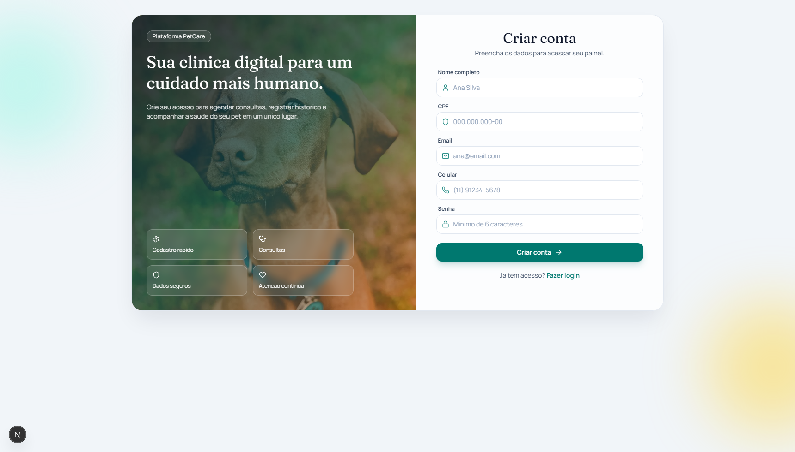
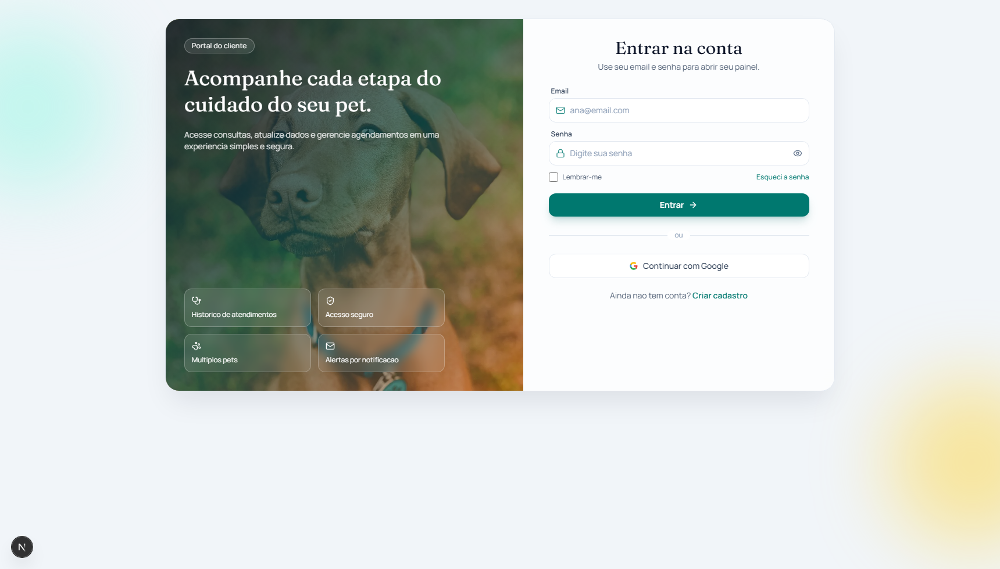
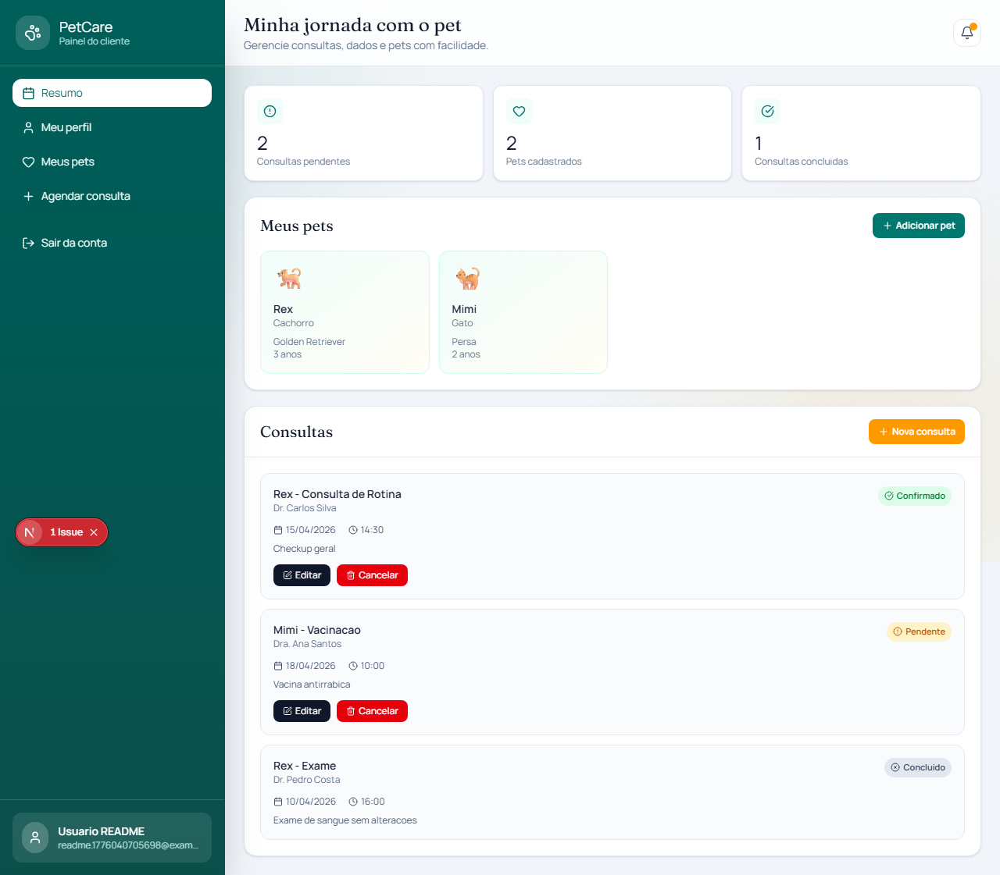
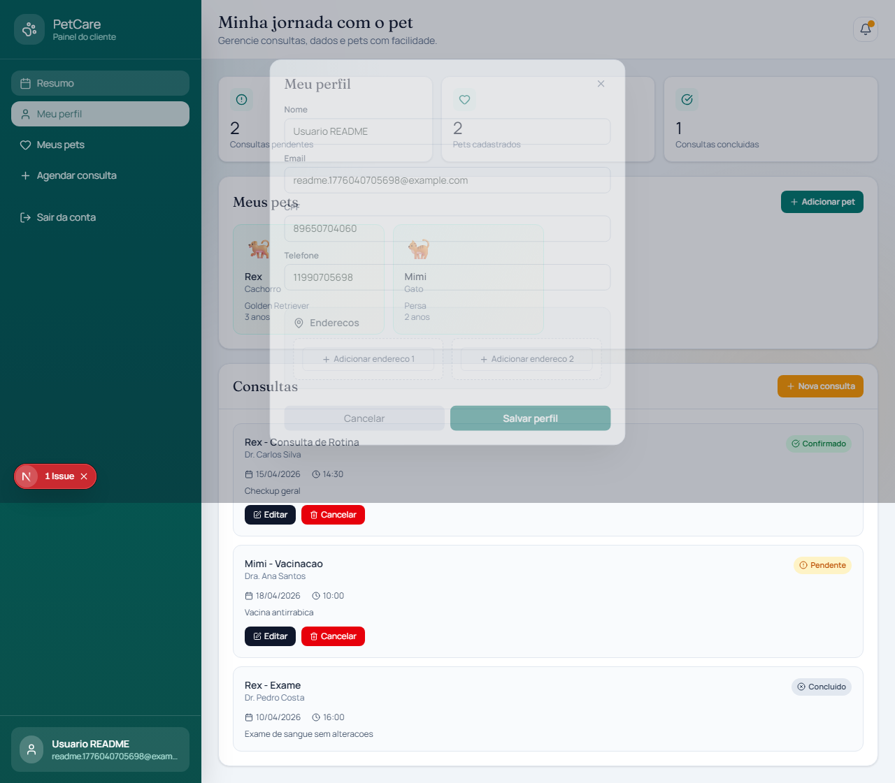
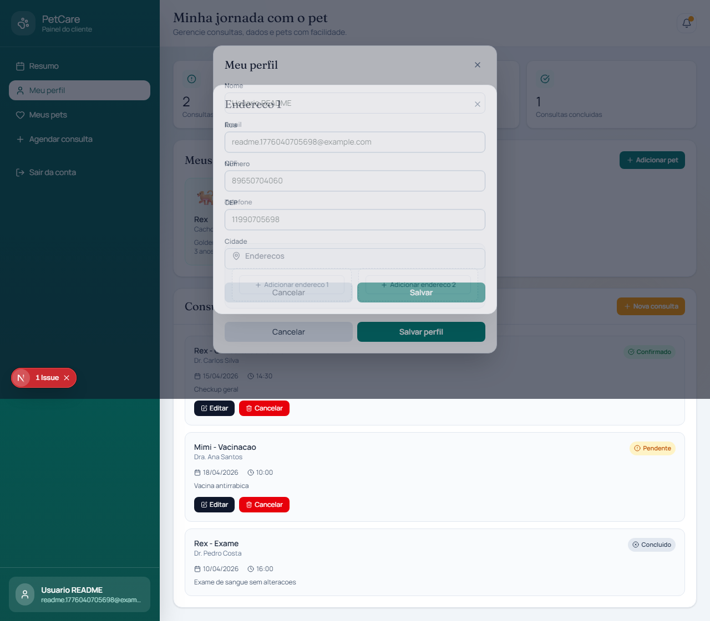
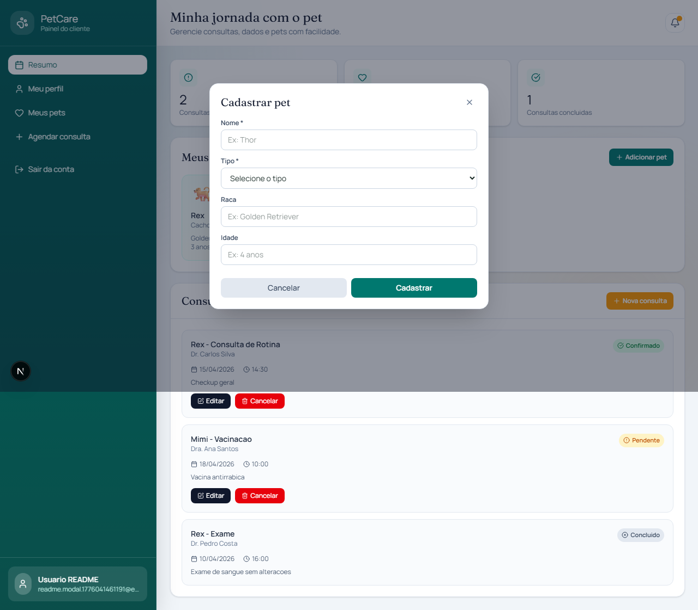
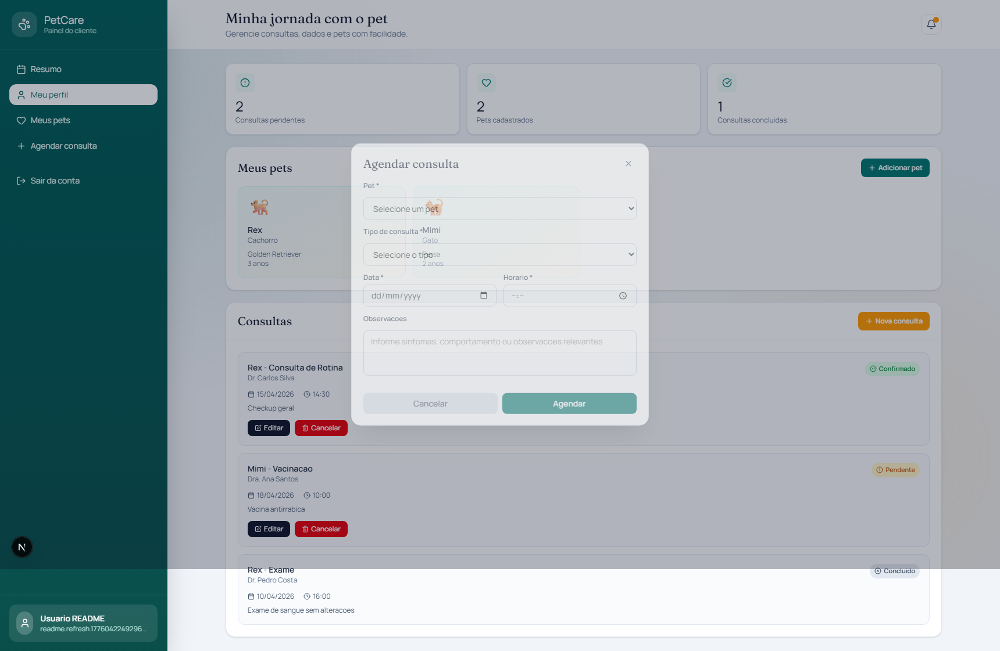

# PetCare - Portal do Cliente

Aplicacao web para clinica veterinaria com fluxo de cadastro, login e painel do cliente para acompanhar pets e consultas.

## Galeria de telas

### Cadastro

)

### Login


### Dashboard


### Modal de perfil


### Modal de endereco


### Modal de pet


### Modal de agendamento


## Especificacoes das funcionalidades

### 1) Cadastro de cliente
- Campos: nome, CPF, email, celular e senha.
- Validacoes com `react-hook-form` + `zod`.
- Mascara para CPF e telefone no frontend.
- Envio para o backend em `POST /clientes`.
- Toast de sucesso/erro e redirecionamento para `/login`.

### 2) Login e sessao
- Login com email e senha via `POST /auth/login`.
- Verificacao de sessao ativa em `GET /clientes/user`.
- Redirecionamento automatico para dashboard quando autenticado.
- Botao de login com Google via `/oauth2/authorization/google`.
- Logout via `POST /auth/logout`.

### 3) Dashboard do cliente
- Rota protegida: sem sessao valida, redireciona para `/login`.
- Cards de resumo com consultas pendentes, pets cadastrados e consultas concluidas.
- Listagem de pets e consultas com interface responsiva.
- Notificacao visual no topo quando existem consultas pendentes.

### 4) Gestao de pets
- Cadastro de pet com nome e tipo obrigatorios.
- Campos opcionais de raca e idade.
- Exibicao em cards no dashboard.

### 5) Gestao de consultas
- Agendar nova consulta (pet, tipo, data, horario e observacoes).
- Editar consulta existente.
- Cancelar consulta pendente/confirmada.
- Status exibidos na listagem (pendente, confirmado, concluido).

### 6) Perfil e enderecos
- Edicao de dados do perfil (nome, email, CPF e telefone).
- Ate 2 enderecos por cliente.
- Adicionar, editar e remover enderecos.

## Integracao backend x frontend

### Integrado com backend
- Cadastro (`/clientes`)
- Login (`/auth/login`)
- Sessao autenticada (`/clientes/user`)
- Logout (`/auth/logout`)

### Atualmente em estado local (frontend)
- Lista de pets
- Lista de consultas
- Edicao de perfil no dashboard
- Enderecos do cliente

## Stack

- Next.js 16
- React 19
- TypeScript
- Tailwind CSS 4
- Framer Motion
- React Hook Form + Zod
- Sonner (toasts)

## Como executar

```bash
npm install
npm run dev
```

Aplicacao frontend: `http://localhost:3000`

Backend esperado em: `http://localhost:8080`

Opcionalmente, configure:

```bash
NEXT_PUBLIC_API_URL=http://localhost:8080
```
